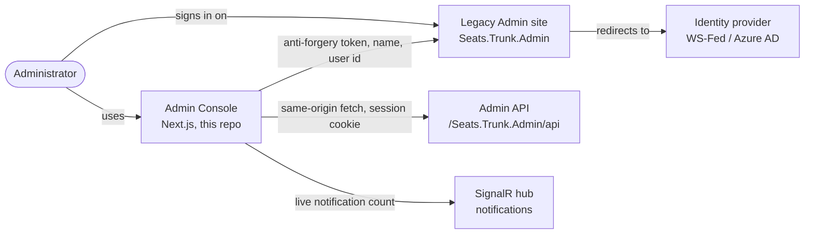
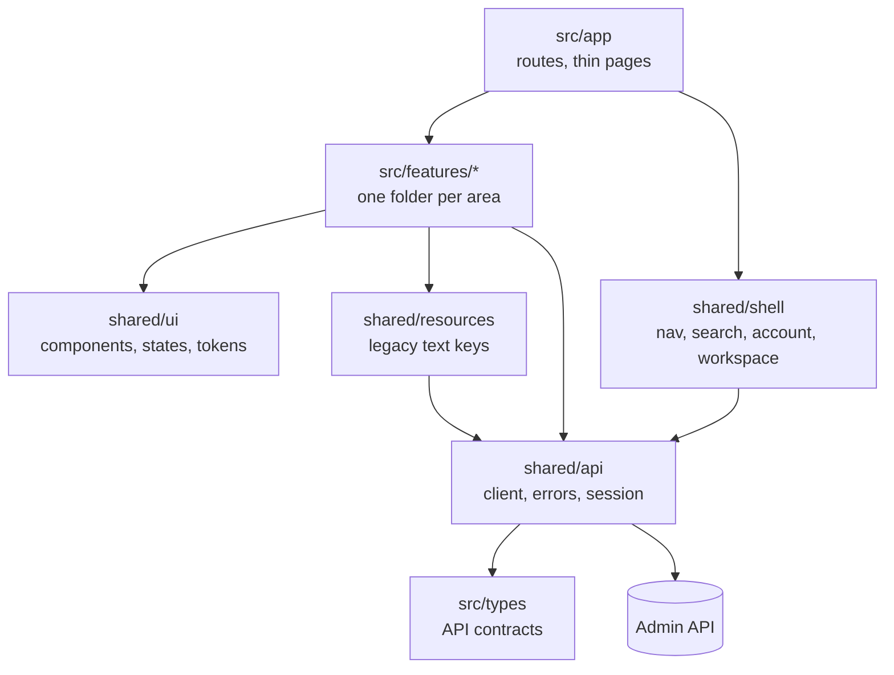
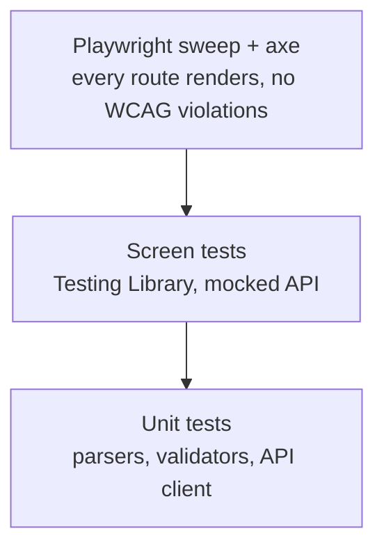

# SEAtS Admin Console

The web console SEAtS administrators use to manage users, access profiles, devices, rooms, settings, imports,
integrations, job schedules and student workflows. A Next.js / React rewrite of the legacy Admin site
(`Seats.Trunk.Admin`) that runs beside it, calls the same API and shares its sign-in and permissions.

[](https://github.com/gautham-seats/Seats-AdminConsole-React/actions/workflows/ci.yml)
[](.github/workflows/ci.yml)
[](.nvmrc)
[](package.json)
[](tsconfig.json)
[](docs/accessibility.md)
[](#safe-mode)
[](#contributing)

History begins on 22 September 2026 as a structured import of the rewrite, landed in reviewable slices.

**Status:** `v0.1.0` — every Admin area is on the shell, safe mode is on, not yet deployed.

## Purpose

|                    |                                                                                                |
| ------------------ | ---------------------------------------------------------------------------------------------- |
| **Users**          | SEAtS administrators at a college or university                                                |
| **Problem**        | The legacy Knockout/Polymer Admin is slow to change and fails the accessibility audit          |
| **This repo owns** | Screens, routing, browser-side validation, accessibility, error/empty/loading states           |
| **Not this repo**  | Permissions, business validation, stored data, sign-in (all stay in the legacy .NET Admin API) |

## Environments

| Environment | Where                                                   | Data                                        | Writes                                  |
| ----------- | ------------------------------------------------------- | ------------------------------------------- | --------------------------------------- |
| Local       | `https://dev.seats.local/admin-next` → `localhost:3001` | The local legacy site; some services mocked | Off unless `ADMIN_ALLOW_WRITES=true`    |
| Production  | Beside the legacy Admin under `/admin-next`             | Live                                        | Deployment is handled outside this repo |

No credentials or connection strings live in this repo. The local proxy setup is in
[docs/local-environment.md](docs/local-environment.md).

## Quick start

**Requirements:** Node 24 ([`.nvmrc`](.nvmrc)), npm, a local SEAtS environment that serves the legacy Admin on
`https://dev.seats.local` and proxies `/admin-next` to port 3001.

```bash
npm ci
cp .env.example .env.local       # ADMIN_ALLOW_WRITES=false — keep it that way
npm run dev                      # http://localhost:3001/admin-next
```

Open `https://dev.seats.local/admin-next`. Sign in on the legacy site first: the console reuses that session
cookie and never shows a login form of its own.

## Commands

| Command                           | Purpose                                                                                             |
| --------------------------------- | --------------------------------------------------------------------------------------------------- |
| `npm run dev`                     | Start the app on port 3001                                                                          |
| `npm run check`                   | The quality gate CI runs: format, types, lint, deps, dead code, tokens, tests, build, bundle budget |
| `npm run format:check`            | Prettier, no rewrites                                                                               |
| `npm run typecheck`               | `next typegen` + `tsc --noEmit`                                                                     |
| `npm run lint`                    | ESLint, zero warnings                                                                               |
| `npm run lint:types`              | type-coverage, strict, at least 95 %                                                                |
| `npm run lint:deps`               | dependency-cruiser: no cycles, no orphans, layer rules                                              |
| `npm run lint:dead`               | knip: unused files, dependencies and exports                                                        |
| `npm run lint:tokens`             | Fails when a design token is declared but never referenced                                          |
| `npm run build:check`             | Production build with `ADMIN_ALLOW_WRITES` forced to `false`                                        |
| `npm run lint:budget`             | Fails when a route's client JavaScript passes its cap in `bundle-budget.json`                       |
| `npm test` / `npm run test:watch` | Jest + Testing Library                                                                              |
| `npm run test:coverage`           | Coverage report                                                                                     |
| `npm run test:e2e`                | Playwright route sweep and axe scan (needs a signed-in profile)                                     |
| `npm run build`                   | Production bundle; reads `ADMIN_ALLOW_WRITES` from `.env.local`                                     |
| `npm run format`                  | Prettier, rewriting files                                                                           |

A pre-commit hook runs lint-staged, typecheck and the tests for changed files; commit messages are checked by
commitlint; a pre-push hook runs `npm run check` and, when the browser profile exists, the route sweep.

## Safe mode

`ADMIN_ALLOW_WRITES` is compiled into the bundle. With `false` the shared client refuses every non-GET request
in the browser (except a short allow-list of side-effect-free POSTs), so the console can be pointed at a real
tenant without changing data. A production build fails unless the value is set explicitly.

## Architecture



The console owns presentation and interaction. The legacy API stays authoritative for permissions, validation
and data. Decisions that deliberately differ from legacy behaviour are numbered in
[docs/decisions.md](docs/decisions.md); legacy defects and whether they are reproduced are in
[docs/legacy-bugs.md](docs/legacy-bugs.md).

### Code structure



```text
src/
├── app/            routes — one folder per area, pages only compose a feature screen
├── features/       one folder per area: screens, api calls, forms, __tests__
├── shared/
│   ├── api/        the only HTTP client, error kinds, session redirect, SignalR
│   ├── shell/      nav bar, command search, account menu, area workspace, leave guard
│   ├── ui/         components, loading/empty/error states, date & time pickers, tokens
│   ├── resources/  legacy resource strings (one POST per screen, cached per culture)
│   └── storage/    per-user browser storage
└── types/          DTOs of the legacy API
docs/specs/         one spec per screen: legacy behaviour, endpoints, differences
e2e/                Playwright sweep and axe scan
```

**Dependency rule:** `shared` never imports from `features` or `app`; `features` never import each other.
Every request goes through `src/shared/api/client.ts`.

### Behaviour that every screen shares

- Every request goes through `src/shared/api/client.ts`, carries the legacy session cookie and the anti-forgery
  token, and comes back as typed data or one `ApiError` kind (`http`, `network`, `aborted`, `blocked`, `parse`,
  `auth`, `token`).
- A 401 stays on the page as "Not authorised"; a 403 or a sign-in redirect means the session is gone and
  triggers one `ForceLogin` redirect; 408 and 428 sign the user out.
- Every data-driven screen renders loading (after 400 ms), populated, empty, error with Retry, and
  not-authorised. An API error is never shown as an empty list.

The sequence diagrams, the error table and the state chart are in
[docs/architecture.md](docs/architecture.md).

## Routes and permissions

Permissions come from `GET UserApi/GetClaims` and mirror the legacy menu (`src/shared/shell/admin-menu.ts`).

| Route                                                                | Area                                    | Permission item                        | Notes                          |
| -------------------------------------------------------------------- | --------------------------------------- | -------------------------------------- | ------------------------------ |
| `/`                                                                  | Landing                                 | first permitted area                   | not-authorised state when none |
| `/users`, `/users/…`                                                 | Users, access profiles, activity, lists | Users, AccessProfiles, Activity        |                                |
| `/settings/…`                                                        | Tenant settings                         | Settings                               | Save needs Edit                |
| `/case/…`                                                            | Workflow admin                          | Case                                   |                                |
| `/students/…`                                                        | GDPR queue, recycle bin                 | StudentsAdmin                          |                                |
| `/engagement/…`                                                      | Engagement config, history              | Engagement                             |                                |
| `/job-schedule`, `/rollback`                                         | Operations                              | JobSchedule, Rollback                  | Rollback read-only             |
| `/imports`, `/integrations`, `/notifications`, `/resources`, `/more` | More menu                               | Import, Integration, UserNotifications |                                |

Full matrix and endpoints: one spec per screen in [docs/specs/](docs/specs/).

## Configuration

| Variable             | Required | Example | Purpose                                 |
| -------------------- | -------: | ------- | --------------------------------------- |
| `ADMIN_ALLOW_WRITES` |      Yes | `false` | Build-time. `false` = read-only console |

That is the whole list. Backend URLs are fixed same-origin paths, never configured here.

## Design system

- **Tokens:** `src/shared/ui/tokens.css`; motion in `motion.css`. High-contrast follows the legacy `_accset_hc` cookie.
- **Components:** `src/shared/ui` (Radix primitives + Tailwind 4). Add a shared component only when two areas need it.
- **Text:** legacy resource keys through `useResources`; hard-coded English only as a fallback constant.
- **Culture:** en-IE / en-GB / en-US / en-NZ from the legacy cookie; dates through `shared/i18n/culture.ts`.
- **Accessibility target:** WCAG 2.2 AA; build-time rules and test cases in [docs/accessibility.md](docs/accessibility.md).
  Reduced motion and Windows High Contrast are honoured in shared components.
- **Browsers:** current Chrome, Edge, Firefox, Safari.

## Testing



| Level   | Covers                                      | Tool             | Where              | Size at `v0.1.0`                    |
| ------- | ------------------------------------------- | ---------------- | ------------------ | ----------------------------------- |
| Unit    | Client, errors, cron, validators, resources | Jest             | `src/**/__tests__` | 126 suites, 954 tests (with screen) |
| Screen  | Rendering, states, permissions, keyboard    | Testing Library  | `src/**/__tests__` | see above                           |
| Browser | Route sweep, accessibility scan             | Playwright + axe | `e2e/`             | 49 routes, WCAG scan on each        |

- One test: `npx jest src/shared/api/__tests__/client.test.ts -t "SF-13"`.
- Browser tests need a signed-in persistent profile; sign in on the legacy site first. A `403` on every call is
  an expired session, not a product defect.
- Every fix ships with a test named after its issue id (`F3-01`, `SF-26`…).
- Coverage floors in `jest.config.ts` (65 % statements and lines, 55 % branches and functions) only go up.
- Console output fails a test: an `act` warning or a stray `console.error` is a failure, not noise.

## Delivery pipeline

Every pull request and every push to `main` runs the jobs below; a tag `v*` also builds and attaches the bundle
to a GitHub Release.

| Job                           | What it checks                                                                                                                                                                                                       |
| ----------------------------- | -------------------------------------------------------------------------------------------------------------------------------------------------------------------------------------------------------------------- |
| Typecheck, lint, tests, build | `npm ci`, `npm audit` (high), Prettier, `tsc`, ESLint, type-coverage, dependency-cruiser, knip, Jest with coverage floors, `next build`, bundle budget (a cap per route in `bundle-budget.json`), unused-token check |
| Secret scan                   | gitleaks over the diff and the history                                                                                                                                                                               |
| Static security analysis      | Semgrep with the JavaScript, TypeScript, React, Node and secrets rule packs                                                                                                                                          |
| Review the diff               | Two advisory model lanes: one hunts defects, one judges test adequacy and security; a finding both make is marked agreed                                                                                             |
| Label oversized pull requests | Adds `needs-split` when one commit changes more than 600 lines                                                                                                                                                       |
| Dependabot                    | Weekly grouped updates for npm and Actions                                                                                                                                                                           |

Every step runs with `pipefail`, so a failure piped into a summary file still fails the job. Deployment
and rollback are owned outside this repo; the bundle is built with `ADMIN_ALLOW_WRITES` set explicitly per
environment.

## Definition of done

- Behaviour matches the legacy screen or a numbered decision says why not (cite legacy file and line in the spec).
- Loading, empty, error, not-authorised and populated states work.
- Keyboard and screen-reader paths tested; no colour-only state.
- No hard-coded user text outside a fallback constant; no request outside the shared client.
- `npm run check` green; a test per fix.
- No credentials, tenant data or personal information in code, docs or tests.

## Troubleshooting

| Problem                                       | Likely cause               | Fix                                                                         |
| --------------------------------------------- | -------------------------- | --------------------------------------------------------------------------- |
| Every API call answers 403 from `/admin-next` | Expired legacy session     | Sign in on `https://dev.seats.local/Seats.Trunk.Admin/` in the same browser |
| "Saving is turned off"                        | Safe mode                  | Expected with `ADMIN_ALLOW_WRITES=false`                                    |
| 502.3 on `/admin-next`                        | Port 3001 not running      | `npm run dev`                                                               |
| Blank text / keys shown                       | Resource POST failed       | Check the legacy site is up; keys fall back to English                      |
| Build fails at `next.config.ts`               | `ADMIN_ALLOW_WRITES` unset | Set it in `.env.local`, or use `npm run build:check`                        |

Deeper notes: [docs/local-environment.md](docs/local-environment.md).

## Contributing

1. Branch per area (`feat/<area>`), Conventional Commits, one small slice with its tests per commit (about
   600 lines at most; the size label says when to split).
2. Read the rules in this README and `docs/`; they apply to every contributor.
3. Every screen has a spec in `docs/specs/`; update it with the change.
4. `npm run check` must pass locally; a pull request needs CI, the secret scan, static analysis, the advisory
   review and the size label green, then a rebase merge.
5. Deliberate departures from legacy go in `docs/decisions.md` (numbered, newest last).

## Ownership

| Responsibility             | Owner                    |
| -------------------------- | ------------------------ |
| Product and decisions      | Gautham Binoy            |
| Frontend                   | Gautham Binoy            |
| Backend API and deployment | SEAtS backend team       |
| Accessibility evidence     | SEAtS accessibility team |

Issues and questions: the repository issue tracker.
