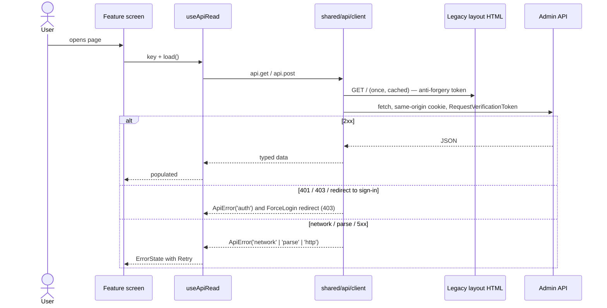
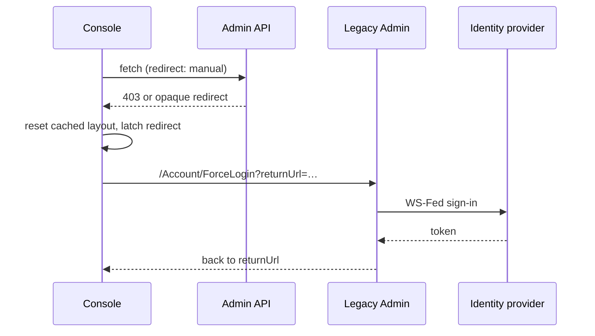
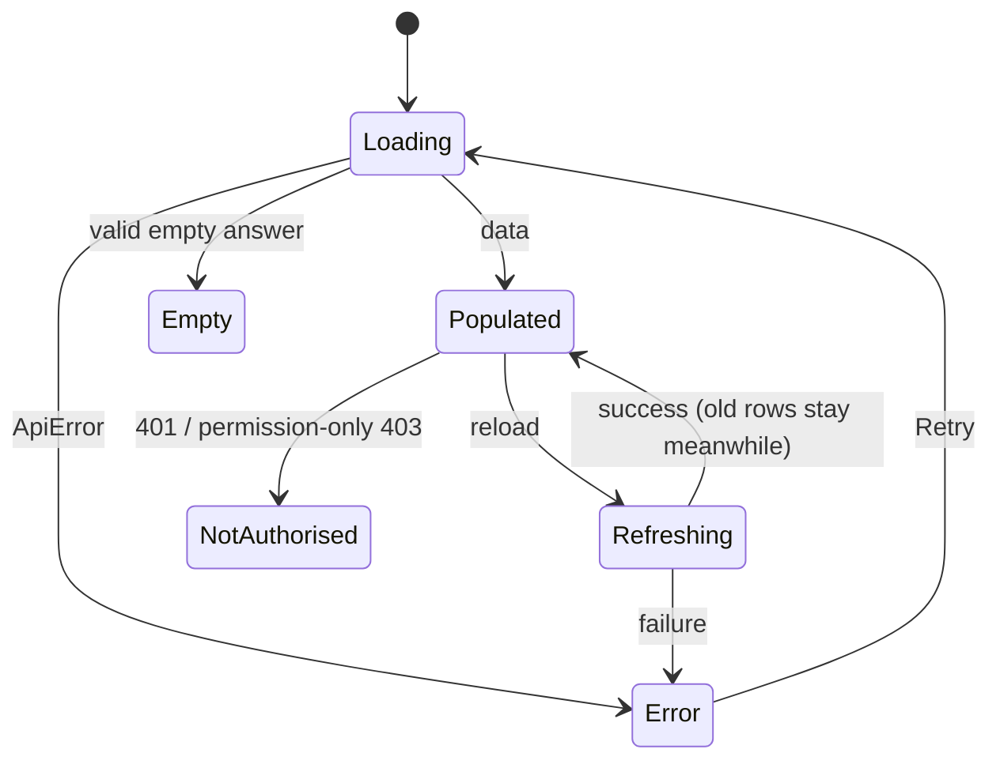

# Architecture notes

How the console talks to the legacy Admin site, what happens when a session expires, and the state
model every data-driven screen follows. The short version, with the system and code-structure
diagrams, is in the [README](../README.md#architecture).

## Request lifecycle

| Concern        | Rule                                                                                                                              |
| -------------- | --------------------------------------------------------------------------------------------------------------------------------- |
| Base URL       | Same origin, `/Seats.Trunk.Admin/api/*`; app served under `/admin-next`                                                           |
| Auth           | Legacy session cookie; anti-forgery token scraped once from the legacy layout HTML                                                |
| 401            | Stays on the page as "Not authorised" (session may still be valid)                                                                |
| 403 / redirect | Session gone → one ForceLogin redirect (latched, released after 5 s or on `pageshow`); permission-only endpoints are allow-listed |
| Errors         | Normalised to `ApiError` kinds: `http`, `network`, `aborted`, `blocked`, `parse`, `auth`, `token`                                 |
| Cancellation   | Every read carries an `AbortSignal`; unmount aborts                                                                               |
| Retries        | None automatic; the user retries from the error state. SignalR reconnects with backoff                                            |
| Cache          | `useApiRead` keeps the last good data while reloading; resource strings cached per culture                                        |
| Parsing        | Every `api.get<unknown>` result goes through a parser before use (an ESLint rule enforces it)                                     |

## Session expiry

A 408 or 428 answer signs the user out instead; a 401 stays on the page. The redirect is latched so
several failing requests produce one navigation, not several.

## UI state model

Every data-driven screen renders all of these; an API error is never shown as an empty list.

Loading shows after 400 ms (`DelayedLoading`) so a fast answer never flashes a spinner. Errors use
`ErrorState`, a valid empty answer uses `EmptyState`, and a table passes `surface="table"` so the
block sits over the visible columns of a sideways-scrolling table.

## Safe mode

`ADMIN_ALLOW_WRITES` is read in `next.config.ts` and compiled into the bundle. With `false` the
shared client refuses every non-GET request in the browser, except a short allow-list of
side-effect-free POST and PUT paths (`READ_ONLY_POST_PATHS`, `READ_ONLY_PUT_PATHS` in
`src/shared/api/config.ts`). A production build fails unless the value is set explicitly, so a
server-side setting can never be mistaken for a working switch.
